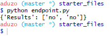
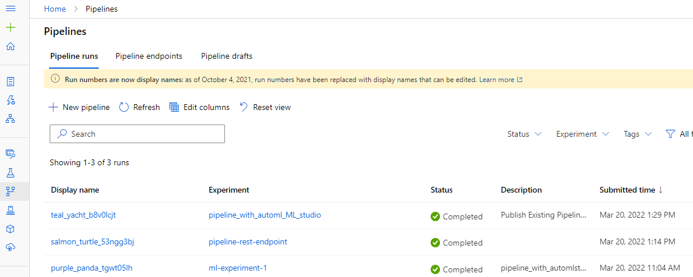

# Machine Learning Operations (MLOps)

An Udacity Project part of the Machine Learning Engineer with Microsoft Azure Nanodegree program. This Project aimed at Operationalizing Machine Learning, by applying DevOps principles to Machine Learning, usually known as MLOPs. I will start by creating an ML model from the Bank Marketing dataset, from there I deploy the model, consume endpoint it and pipeline automation. it. 

The Models for the project was created with both Azure Machine Learning studio using *Automated ML* and Azure Machine Learning SDK for Python using [Notebooks](starter_files/aml-pipelines-with-automated-machine-learning-step.ipynb).

## Architectural Diagram

The Architectural Diagram provided below starts from Authentication and ends with Documentation.


## Key Steps

1.  Authentication
2.  Automated ML Experiment
3. Deploy the best model
4. Enable logging
5. Swagger Documentation
6. Consume model endpoints
7. Create and publish a pipeline
8. Documentation

**1. Authentication**

Starts by creating a Service Principal(SP) account which is a user role that helps to control scope of permissions. Here, SP is assigned to  access the "Bank-mkt" workspace.

Here I used Git Bash which support Unix-based utilities on windows environment. It also supports Git command line experience.

* az login is an azure command which logs you into azure.
* Browser displays after authentication with *az login*
* Create a Service Principal
* Capture objectId using clientID
* SP now has access to Bank-mkt workspace in Azure.

Some key values in the image below are redacted for security reasons.


**2. Automated ML Experiment**

*  First clone starter files using terminal in Microsoft Machine Learning Studio via Notebooks.


* Dataset Registered in Datasets


* Create an AutoML Experiment in Azure Machine Learning Studio.
  
* Experiment Completed and Best Model

After running AutoML, the Best model for this experiment is VotingEnsemble


**3. Deploy the Best Model**


**4. Enable Logging**

Enable Application Insights gives us information about how the deployed services is behaving.

* Download Config file from Azure ML sdk


config.json content

```json
{
    "subscription_id": "xxxxxxxxxx",
    "resource_group": "bank-mkt",
    "workspace_name": "Bank-mkt"
}
```

these contents will be used by ```py Workspace.from_config() ``` in the logs.py

* Write a python script to set deployment name to load web service and application insights to True.

```python
#logs.py

from azureml.core import Workspace
from azureml.core.webservice import Webservice

# Requires the config to be downloaded first to the current working directory
ws = Workspace.from_config()

# Set with the deployment name
name = "bank-mkt-model"

# load existing web service
service = Webservice(name=name, workspace=ws)

# enable application insight
service.update(enable_app_insights=True)

logs = service.get_logs()

for line in logs.split('\n'):
    print(line)
```
* Run logs.py file in the terminal to enable application insight


* Application insight enabled


  
**5. Swagger Documentation**

Consume the deployed model using Swagger.
Documentation is a core pillar of operations.

* Makes documentation easier by explaining:

  * What the API accepts:HTTP POST and GET requests
  * What types of inputs
  * What are the endpoints
* Easier and more confident interaction

[Source: Udacity ML Engineer Azure](https://www.udacity.com/course/machine-learning-engineer-for-microsoft-azure-nanodegree--nd00333)

```sh
#swagger.sh
docker pull swaggerapi/swagger-ui
docker run -p 9000:8080 swaggerapi/swagger-ui
```

* run swagger.sh


* Swagger interactions


**6. Consume Model Endpoints**

* Result



* Benchmark the endpoint

It is an acceptable performance measure or baseline.

Send data.json 10 times and see performance numbers from azure.


Out of the 10 request, no failed request.
we took close to 1.4 seconds for all the request to go through. We are taking about 139.915 miliseconds per request.


**7. Create, Publish and Consume a Pipeline**

* Pipeline Created


* Publish Pipeline to enabel REST endpoint


* Verify Published Pipeline
!(Verify Published Pipeline)(screenshots/18_Verify_published_pipeline.png)

* Publish Pipeline via Python SDK


* Verify if pipeline is published again


* Bankmarketing dataset with the AutoML module


* Pipeline rest endpoint created and Active




* Run Detail Widget


* Show Scheduled run in experiment


## Screen Recording

[Screen Recording](https://youtu.be/rvGBalYFrZI) of the screenshots.

## References

1. [Udacity ML Engineer Azure](https://www.udacity.com/course/machine-learning-engineer-for-microsoft-azure-nanodegree--nd00333)
2. [Microsoft Learn](https://docs.microsoft.com/en-us/learn/paths/build-ai-solutions-with-azure-ml-service/)
